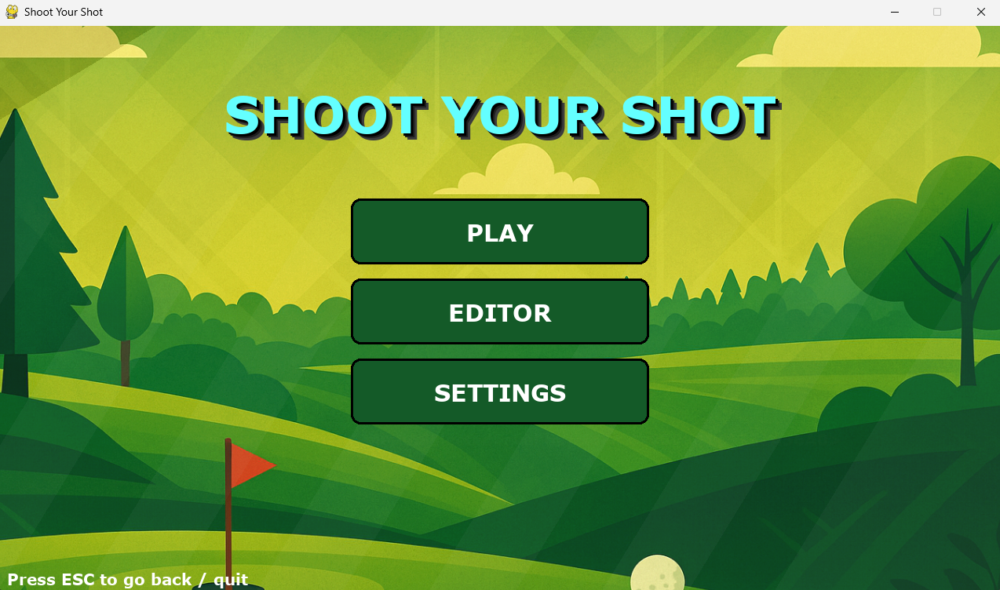
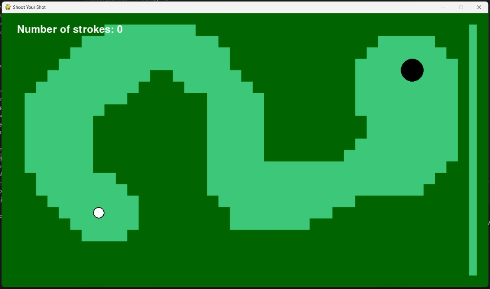

# SHOOT YOUR SHOT
### Mini golf game written in python, as a group project.
###### 

## 💥Features
- Mini-golf gameplay with physics
- Multiple playable levels
- Pause menu with resume and restart
- Level completion interface
- Built-in level editor


## 🖼️Screenshots




## ⏯️Installation
Clone this repo using:
```git
git clone https://Quan1umMango/shoot-your-shot
```
After cloning, open your terminal into the newly cloned folder.
Then run this command to install the requirements
```
py -m pip install -r requirements.txt
```
##   **🤖Gameplay**

| Key           | Action                       |
| ------------- | ---------------------------- |
| Mouse Drag    | Aim & Shoot                  |
| `P` / `Esc`   | Pause Game                   |


## ✏️ EDITOR CONTROLS
### To Enter Editor Mode Press Custom 
| Key | Function            |
| --- | ------------------- |
| `1` | Static Block        |
| `2` | Moving Block        |
| `3` | Ball Start Position |
| `4` | Hole Position       |
| `5` | Erase Object        |
| `W` | Increase Width       |
| `H` | Increase Height        |
| `Shift+W` | Decrease Width      |
| `Shift+H` | Decrease Height        |
  


 


## 🏗️ Architecture
| Component / Module     | Responsibility   | Description              |
| ---------------------- | ---------------- | ------------------------ |
| `main.py`              | Entry point      | Runs the main game loop  |
| `constants.py`         | Configuration    | Stores global settings   |
| `serde.py`             | Serialization    | Saves and loads levels   |
| `App`                  | Controller       | Manages application flow |
| `AppState`             | State machine    | Controls game states     |
| `Menu`                 | Main menu        | Handles navigation       |
| `Level`                | Game controller  | Manages level logic      |
| `Ball`                 | Physics          | Handles movement         |
| `Block`                | Obstacle base    | Collision boundaries     |
| `StaticBlock`          | Fixed obstacle   | Immovable blocks         |
| `MovingBlock`          | Dynamic obstacle | Moving blocks            |
| `PauseMenu`            | Pause UI         | Resume and restart       |
| `LevelCompleteMenu`    | Completion UI    | Next level options       |
| `ui_misc.py`           | UI helpers       | Buttons and text         |
| `Editor`               | Level editor     | Create custom levels     |
| `Tool Manager`         | Editor control   | Tool selection           |
| `Resize System`        | Object scaling   | Modify sizes             |
| `Erase Tool`           | Object removal   | Delete objects           |

## 🔄 Game Flow
1. Launch game
2. Select level from menu / Make your Custom Level
3. Play level
4. Pause or complete level
5. Restart, proceed, or return to menu


## 📕 Learning Outcomes
- State-based game architecture
- Event handling in Pygame
- Basic physics simulation
- Modular Python design


## 👥 Team
- Aston Dsouza (PES2UG25CS108) — Core gameplay
- Ahmed Aftab Kola (PES2UG25EC012) — Main menu & Icons
- Deekshith KP (PES2UG25CS153)— Sound & levels
- Anish V Naik (PES2UG25CS074)— GUI & documentation

## 📄 License
This project is created for educational purposes.


